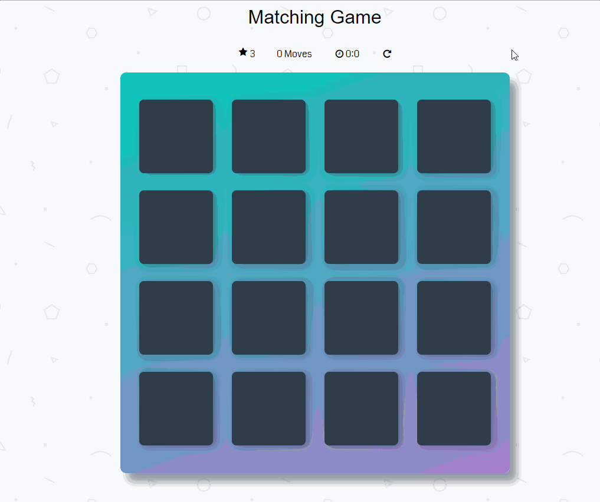

# The Memory Challange

### Objective
Your task is to build a memory game using React and Typescript. The game should test a user's ability to remember and match pairs of items on a grid. The challenge will increase with each level cleared.

### Core Requirements:
- Implement a grid-based memory game where users flip cards to find matching pairs.
- The game should track the number of moves and the time taken.
- A timer should be present, and the game ends if the timer runs out.
- When a level is successfully completed, the user should be able to proceed to the next level.
- The game should have a clear win/loss state.

### Level Progression:
- **Level 1:** Starts with a 3x2 grid and a 30-second timer.
- **Subsequent Levels:** For each new level, the grid size should increase by one dimension (e.g., 4x3, 5x4, and so on), and the timer should be extended by an additional 15 seconds.

### Demo:
